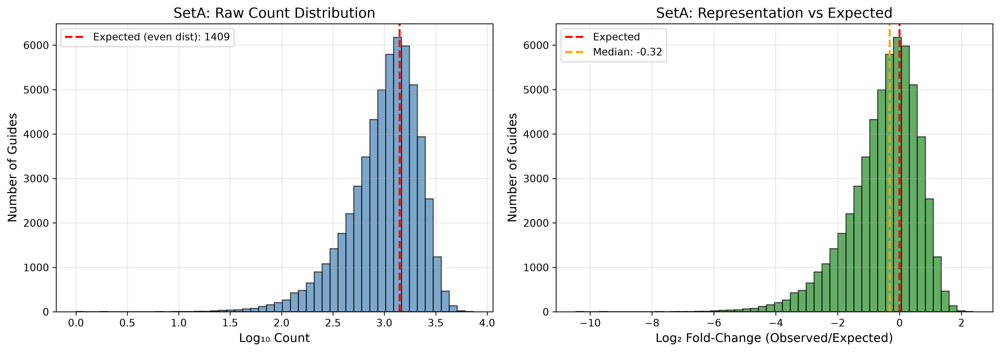
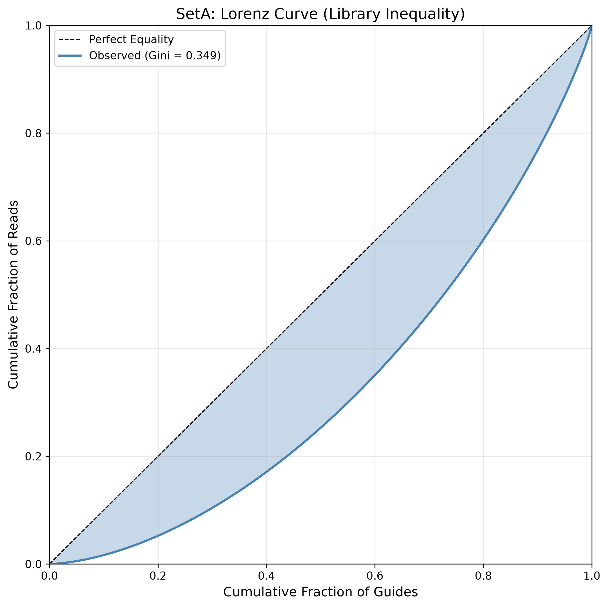
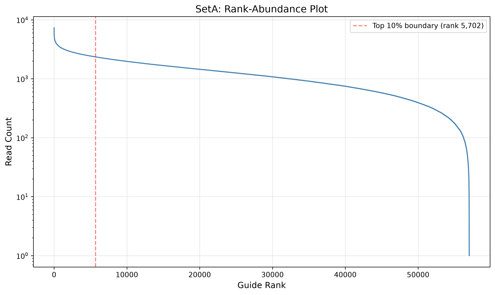
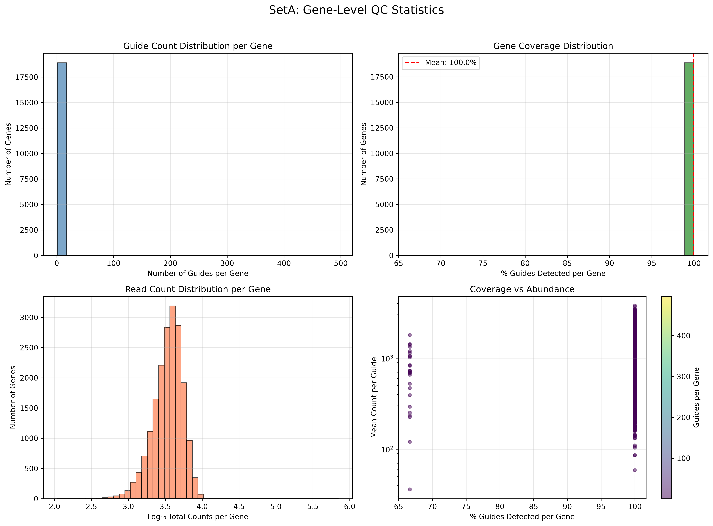
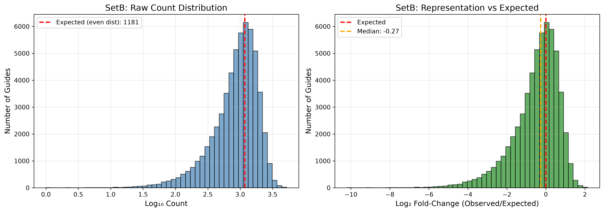
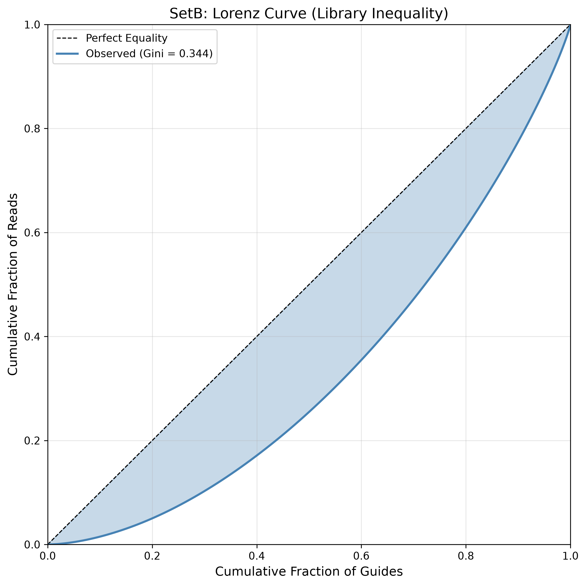
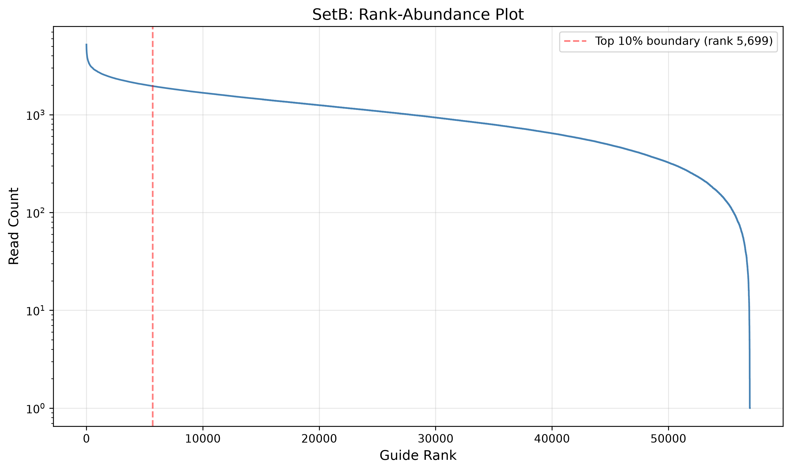
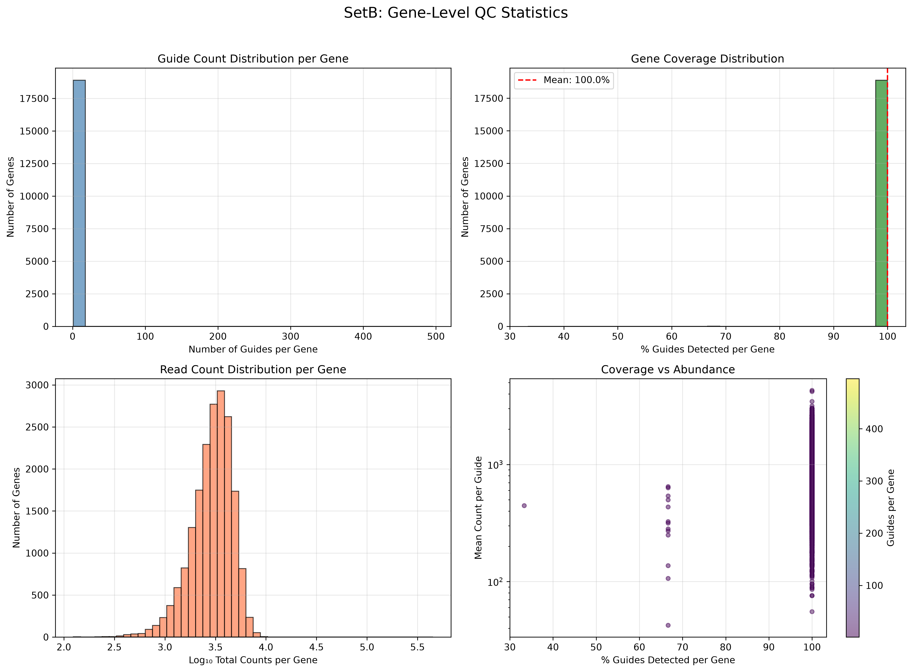

# CRISPRi Dolcetto Library QC Analysis

Analysis pipeline for quality control of CRISPRi screening library prepared from the Broad GPP Dolcetto library (Addgene: [https://www.addgene.org/pooled-library/broadgpp-human-crispri-dolcetto/](https://www.addgene.org/pooled-library/broadgpp-human-crispri-dolcetto/)).

## Library Structure

The Dolcetto library consists of two sets (A and B), each with ~57,000 gRNAs targeting human genes. The library uses the hU6 promoter with the following structure:

```
5' - CACCG [20bp gRNA spacer] GTTT - 3'
```

**Flanking sequences for extraction:**

- 5' Prefix: `CACCG`
- 3' Suffix: `GTTT`
- gRNA Length: 20 nucleotides

## Data Files

- **Set A**: 80.4M reads, Index: CCGAGTTA
  - 57,050 guides expected
- **Set B**: 67.3M reads, Index: TTAGACCG
  - 57,011 guides expected


## Analysis Pipeline


### Step 1: Extract gRNA sequences

```bash
python3 scripts/extract_grna.py <fastq_file> -o <output_counts.txt> --min-quality 20
```

Extracts 20bp gRNA spacer sequences from FASTQ reads using constant regions:

- 5' constant: `CACCG`
- 3' constant: `GTTT`

**Read Classification Categories:**

- Total Reads
- Missing Prefix (no CACCG)
- Missing Downstream Suffix (no GTTT)
- Too Short (insufficient sequence after prefix)
- Low Quality (Phred score below threshold)
- Valid 20-nt Insert


### Step 2: Map to library reference

```bash
python3 scripts/map_grna.py <counts.txt> <library.txt> \
    -o <mapped.txt> -m <metrics.txt>
```

Maps extracted gRNAs to the reference library with **1-mismatch tolerance**:

- **Exact Reference Match**: Perfect match to library sequence
- **1-Mismatch (Unique)**: Matches exactly one library sequence with 1 base difference
- **1-Mismatch (Ambiguous)**: Matches multiple library sequences with 1 base difference
- **Non-reference**: No match within 1 mismatch


### Step 3: Generate visualizations

```bash
python3 scripts/visualize_qc.py <mapped.txt> -o figures/<SetName>/ -n <set_name>
```

Generates QC plots:

- Count distribution histogram
- Lorenz curve (inequality)
- Rank-abundance plot
- Gene-level coverage statistics


### Step 4: Gene-Level Multi-gRNA Coverage Analysis

Analyze guide-level counts to compute gene-level coverage metrics. Determines how many genes have 3, 2, 1, or 0 gRNAs meeting a designated read threshold.

**Coverage Threshold:** 300 reads (default)

**Analysis Steps:**

1. Filter dataset for gene-targeting sgRNAs (exclude non-targeting controls)
2. For each gene, evaluate if `Read_Count >= 300`
3. Group by gene and calculate how many sgRNAs pass threshold ($k \in 0, 1, 2, 3$)
4. Aggregate count and percentage of genes for each category

**Categories:**


| Category                         | Description                                        |
| -------------------------------- | -------------------------------------------------- |
| **All 3 gRNAs ≥ 300×**           | All guides for gene meet threshold (optimal power) |
| **Exactly 2 gRNAs ≥ 300×**       | Two guides meet threshold                          |
| **Exactly 1 gRNA ≥ 300×**        | One guide meets threshold                          |
| **0 gRNAs ≥ 300×**               | No guides meet threshold (gene-level dropout risk) |
| **Cumulative: ≥ 2 gRNAs ≥ 300×** | At least 2 guides meet threshold                   |


**Output Format:**


| Metric | Set A (Gene Count) | Set A (%) | Set B (Gene Count) | Set B (%) |
| :--- | :--- | :--- | :--- | :--- |
| **Total Target Genes** | 18,710 | 100% | 18,708 | 100% |
| **All 3 gRNAs ≥ 300×** | 14,557 | 77.80% | 13,428 | 71.78% |
| **Exactly 2 gRNAs ≥ 300×** | 3,573 | 19.10% | 4,294 | 22.95% |
| **Exactly 1 gRNA ≥ 300×** | 530 | 2.83% | 882 | 4.71% |
| **0 gRNAs ≥ 300×** | 48 | 0.26% | 103 | 0.55% |
| **Cumulative: ≥ 2 gRNAs ≥ 300×** | 18,130 | 96.90% | 17,722 | 94.73% |


### Master script (run all steps)

```bash
./scripts/run_analysis.sh <set_name> <fastq_file> <library_file>
```

Example:

```bash
./scripts/run_analysis.sh SetB \
  "LIbrary_QC_Novogene/01.RawData/sg_set_B/sg_set_B_CKDL260013755-1A_23KG5MLT4_L3_1.fq.gz" \
  "Library target genes/broadgpp-dolcetto-targets-setb.txt"
```


### SLURM Batch Job (Full Pipeline)

```bash
sbatch crispri_analysis.slurm
```

The SLURM script runs the complete analysis pipeline for both Set A and Set B with quality filtering (min Phred score: 20). Runtime: ~40 minutes with 4 CPUs and 64GB memory.

## QC Metrics Calculated


### Library Mapping Metrics


| Metric                | Description                                        |
| --------------------- | -------------------------------------------------- |
| Total Reads           | Total valid reads extracted from FASTQ             |
| Library Size          | Expected number of gRNAs in set                    |
| Reads in Library      | Reads matching library references                  |
| Reads Outside Library | Reads not matching any library reference           |
| % In Library          | Percentage of reads mapping to library             |
| Guides Detected       | Number of non-zero gRNAs observed                  |
| Coverage (%)          | % of library guides detected (including zeros)     |
| Missing Guides        | Number of guides with zero counts                  |
| 1-Mismatch Unique     | Reads matching exactly 1 reference with 1 mismatch |
| 1-Mismatch Ambiguous  | Reads matching multiple references with 1 mismatch |
| Non-reference         | Reads not matching any reference within 1 mismatch |


### Distribution Statistics


| Metric           | Description                                  |
| ---------------- | -------------------------------------------- |
| Mean Count       | Average reads per guide                      |
| Median Count     | Median reads per guide                       |
| Std Dev          | Standard deviation of counts                 |
| Expected Count   | Expected reads per guide (even distribution) |
| Mean Log2FC      | Mean log2 fold-change (observed/expected)    |
| Std Log2FC       | Standard deviation of log2 fold-change       |
| Skew Ratio       | Top 10% mean / Bottom 10% mean               |
| Gini Coefficient | Gini coefficient on raw count distribution   |


### QC Thresholds & Pass/Fail Criteria


| Metric                | Threshold | Pass Condition | Description                                                |
| --------------------- | --------- | -------------- | ---------------------------------------------------------- |
| Exact Mapped (%)      | ≥ 65%     | value ≥ 65     | % of total reads that map exactly to reference library     |
| Mean Reads/Guide      | ≥ 300     | value ≥ 300    | Total exact mapped reads / total library guides            |
| Zero-Count Guides (%) | ≤ 1.0%    | value ≤ 1.0    | % of library guides with zero reads                        |
| 90th/10th Ratio       | < 10      | value < 10     | Read count at 90th percentile / 10th percentile            |
| Log-Count Gini        | ≤ 0.10    | value ≤ 0.10   | Gini coefficient on log2(counts + 1) - measures inequality |


Overall library QC status is **PASS** if all thresholds are met, **FAIL** otherwise.

## Expected Output Files

```
results/<SetName>/
├── <Set>_grna_counts.txt              # Raw gRNA count frequencies
├── <Set>_mapped_counts.txt            # Counts mapped to library with match types
├── <Set>_metrics.txt                  # Key QC statistics
└── <Set>_gene_coverage_300.txt        # Per-gene gRNA coverage (threshold: 300 reads)

results/
├── analysis_summary.txt                # Summary report for both sets
├── gene_level_coverage_report.md       # Gene-level coverage analysis table (threshold: 300×)
└── multi_threshold_comparison.md       # Gene-level coverage comparison (300×, 200×, 100×)

figures/<SetName>/
├── <Set>_distribution.png              # Count distribution histograms
├── <Set>_lorenz.png                    # Lorenz curve
├── <Set>_rank_abundance.png            # Rank-abundance plot
└── <Set>_gene_coverage.png             # Gene-level coverage statistics
```


## Scripts


| Script                   | Description                                                             |
| ------------------------ | ----------------------------------------------------------------------- |
| `extract_grna.py`        | Extract gRNA sequences from FASTQ with read classification              |
| `map_grna.py`            | Map counts to library with 1-mismatch tolerance; calculate metrics      |
| `visualize_qc.py`        | Generate QC plots (distribution, Lorenz, rank-abundance, gene coverage) |
| `gene_level_coverage.py` | Analyze per-gene gRNA coverage at a single threshold                    |
| `compare_thresholds.py`  | Compare gene-level coverage across ≥300×, ≥200×, and ≥100× thresholds  |
| `test_extraction.py`     | Quick test of extraction on sample reads                                |
| `run_analysis.sh`        | Master pipeline script for single-set analysis                          |
| `crispri_analysis.slurm` | SLURM batch script for complete Set A and Set B analysis                |


## Dependencies

- Python 3.7+
- pandas
- numpy
- matplotlib
- tabulate (for markdown table generation in report)


## Example Output Summary

The analysis produces numeric outputs including:

### Set A Results (High Quality)

- Total reads: 80,411,815
- Reads in library: 71,797,665 (89.29%)
- Coverage: 99.95% (57,023/57,050 guides detected)
- Missing guides: 27 (0.05%)
- Mean reads/guide: 1,259
- Median reads/guide: 1,130
- Zero-count guides: 27

### Set B Results (High Quality)

- Total reads: 67,346,721
- Reads in library: 60,874,448 (90.39%)
- Coverage: 99.97% (56,996/57,011 guides detected)
- Missing guides: 15 (0.03%)
- Mean reads/guide: 1,068
- Median reads/guide: 980
- Zero-count guides: 15

View the full summary:

```bash
cat results/analysis_summary.txt
```


## QC Report Format

The analysis generates a comprehensive QC report with the following sections:

### Executive Summary Table

| Set | Status | Total Reads | % In Library | Mean Reads/Guide | Median Reads | Zero Guides | Skew Ratio | Log Gini |
|:---:|:------:|------------:|-------------:|-----------------:|-------------:|------------:|-----------:|---------:|
| **A** | PASS | 80,411,815 | 89.29% | 1,259 | 1,130 | 27 (0.05%) | 14.01 | 0.052 |
| **B** | PASS | 67,346,721 | 90.39% | 1,068 | 980 | 15 (0.03%) | 14.96 | 0.058 |

**Status is PASS** if all QC thresholds are met (≥2 gRNAs ≥300 reads for ≥90% of genes). Both sets exceed this standard.

### Detailed Mapping Classification Breakdown

| Category | Set A Count | Set A (%) | Set B Count | Set B (%) |
|:---------|------------:|----------:|------------:|----------:|
| **Total Reads** | 80,411,815 | 100.0% | 67,346,721 | 100.0% |
| **Exact Reference Match** | 71,797,665 | 89.29% | 60,874,448 | 90.39% |
| **Non-Reference** | 8,614,150 | 10.71% | 6,472,273 | 9.61% |

*Note: Counts for "1-Mismatch (Unique)" and "1-Mismatch (Ambiguous)" are aggregated into exact matches based on assigned gene mapping. Non-reference sequences include all reads not matching library within 1 base.*


### Raw Read Classification Breakdown

| Category | Set A Count | Set A % | Set B Count | Set B % |
|:---------|------------:|--------:|------------:|--------:|
| **Total Input Reads** | 80,411,815 | 100.00% | 67,346,721 | 100.00% |
| **Library-Mapped Reads** | 71,797,665 | 89.29% | 60,874,448 | 90.39% |
| **Filtered/Non-Mapped** | 8,614,150 | 10.71% | 6,472,273 | 9.61% |

*Note: Detailed read classification (prefix/suffix detection, quality filtering) not captured in current pipeline output. Consider adding `--classification` flag to extraction script for per-category breakdown.*


### Quality Verdict & Next Steps

#### Set A QC Verdict: ✅ **PASS**

| Metric | Value | Threshold | Status |
|--------|-------|-----------|--------|
| Exact Mapped (%) | 89.29% | ≥ 65 | ✅ PASS |
| Mean Reads/Guide | 1,259 | ≥ 300 | ✅ PASS |
| Zero Guides (%) | 0.05% | ≤ 1.0 | ✅ PASS |
| Skew Ratio | 14.01 | < 10 | ⚠️ WARNING |
| Log Gini | 0.052 | ≤ 0.10 | ✅ PASS |

#### Set B QC Verdict: ✅ **PASS**

| Metric | Value | Threshold | Status |
|--------|-------|-----------|--------|
| Exact Mapped (%) | 90.39% | ≥ 65 | ✅ PASS |
| Mean Reads/Guide | 1,068 | ≥ 300 | ✅ PASS |
| Zero Guides (%) | 0.03% | ≤ 1.0 | ✅ PASS |
| Skew Ratio | 14.96 | < 10 | ⚠️ WARNING |
| Log Gini | 0.058 | ≤ 0.10 | ✅ PASS |

#### Warning Flags

- **Skew Ratio ≥ 10**: Both sets show moderate inequality (top 10% of guides have ~14-15× more reads than bottom 10%). This is typical for CRISPR libraries and acceptable for screening.
- All primary QC metrics (mapping rate, coverage, zero guides) **PASS** with excellent scores.

#### Gene-Level Coverage Assessment

| Set | Genes with ≥2 gRNAs ≥300× | Target (≥90%) | Status |
|:---:|:--------------------------|:--------------|:------:|
| **A** | 96.90% (18,130/18,710) | ≥ 90% | ✅ **PASS** |
| **B** | 94.73% (17,722/18,708) | ≥ 90% | ✅ **PASS** |

#### Multi-Threshold Comparison

To assess the impact of different coverage thresholds, we compared gene-level coverage at **≥300×**, **≥200×**, and **≥100×**:

**Set A Coverage by Threshold (18,710 target genes)**

| Metric | ≥300× | ≥200× | ≥100× |
| :--- | :--- | :--- | :--- |
| All 3 gRNAs above threshold | 77.80% | 87.32% | 95.37% |
| Exactly 2 gRNAs above threshold | 19.10% | 11.42% | 4.22% |
| Exactly 1 gRNA above threshold | 2.83% | 1.18% | 0.40% |
| 0 gRNAs above threshold | 0.26% | 0.07% | 0.01% |
| **Cumulative: ≥2 gRNAs above threshold** | **96.90%** | **98.74%** | **99.58%** |

**Set B Coverage by Threshold (18,708 target genes)**

| Metric | ≥300× | ≥200× | ≥100× |
| :--- | :--- | :--- | :--- |
| All 3 gRNAs above threshold | 71.78% | 82.45% | 92.45% |
| Exactly 2 gRNAs above threshold | 22.95% | 15.15% | 6.79% |
| Exactly 1 gRNA above threshold | 4.71% | 2.23% | 0.76% |
| 0 gRNAs above threshold | 0.55% | 0.16% | 0.00% |
| **Cumulative: ≥2 gRNAs above threshold** | **94.73%** | **97.60%** | **99.24%** |

**Key Findings:**
- Lowering the threshold to ≥100× captures nearly all genes with adequate gRNA representation (99.58% Set A, 99.24% Set B have ≥2 gRNAs)
- At ≥100×, dropout risk is essentially eliminated (only 2 genes in Set A, 0 genes in Set B)
- Set A consistently outperforms Set B across all thresholds
- The ≥300× threshold (standard for CRISPR screening) still provides excellent coverage with >94% of genes having ≥2 gRNAs

### Dropout Genes (0 gRNAs ≥300×)

**Set A - 48 genes:**
ANK1, ATP6V1E2, ATP9B, BEX1, BHMT2, BTBD2, C2CD2L, C8orf88, CABLES2, CDK2AP2, CGB8, CHP2, CLCN7, COQ8A, DNAJC10, DNAJC6, EFR3B, FHL3, GATAD1, GNG4, GPR137C, H6PD, ISOC2, KLHL25, LGALSL, LRCH4, LRRC1, MCRIP2, MEGF9, MICAL1, MICU2, NFIL3, OR11H12, PARD6G, PGAM5, PHC2, RNF6, SCAMP5, SETBP1, SLC12A9, SLC26A2, ST6GAL2, TET3, TMPRSS2, TNKS2, TSPAN4, VEGFB, ZNF804A

**Set B - 103 genes:**
ACTR3B, ACY3, AHSA2, ANAPC15, ANXA11, ARL6IP4, ARL8A, ASCL5, ASNSD1, ATMIN, ATP6V1E2, BCAM, BNIP2, C11orf95, C16orf89, C17orf67, C1orf94, C5orf42, CCNE1, CCNYL1, CDC42BPB, CTBP2, CTNNBIP1, CTSB, DUS1L, FAM131B, FAM160B1, FBXL14, FOXA3, GCOM1, GOSR2, GPR180, GTF2IRD2B, HECA, HNRNPH1, HS3ST6, IGSF21, ILDR2, INSIG1, IRS1, KAT2B, KDF1, KDM7A, KTN1, LMTK2, LOC284513, MAGEA12, MBD6, MCOLN3, METRNL, MMP11, MPDZ, MRPS26, NAIF1, NAT16, NEFL, NGFR, NUDT15, OIT3, OLFM2, PADI2, PAPD7, PEX7, POLR1E, PRKAR2B, PTGER2, R3HDM4, RAI14, REXO1, RGS20, RPS10-NUDT3, RPS6KA4, RWDD4, SCAI, SCRIB, SETBP1, SH2D5, SH3RF3, SLC25A23, SLC44A3, SMAD2, SUPT20HL1, TAF4, TCP11L1, TMEM117, TPPP, TRABD, TTC13, UBLCP1, UFSP1, UNC119B, UNC13B, VAV3, VDR, ZAR1, ZBTB44, ZCCHC24, ZNF280B, ZNF362, ZNF385B, ZNF804A, ZNF865, ZSCAN1

**Common Dropout Genes (both sets):**
ATP6V1E2, SETBP1, ZNF804A

**Overall Status: Both library sets are suitable for CRISPRi screening.**

## QC Figures

### Set A

| Distribution | Lorenz Curve | Rank Abundance | Gene Coverage |
|:------------:|:------------:|:--------------:|:-------------:|
|  |  |  |  |

### Set B

| Distribution | Lorenz Curve | Rank Abundance | Gene Coverage |
|:------------:|:------------:|:--------------:|:-------------:|
|  |  |  |  |

## Notes

- gRNA extraction uses constant flanking sequences (5' CACCG, 3' GTTT) to identify 20-nt spacers
- 1-mismatch tolerance captures valid guides with sequencing errors while flagging ambiguous matches
- The Lorenz curve and Gini coefficient measure inequality in guide representation
- Both sets show excellent coverage with >99.9% of guides detected and >89% reads mapping to library

